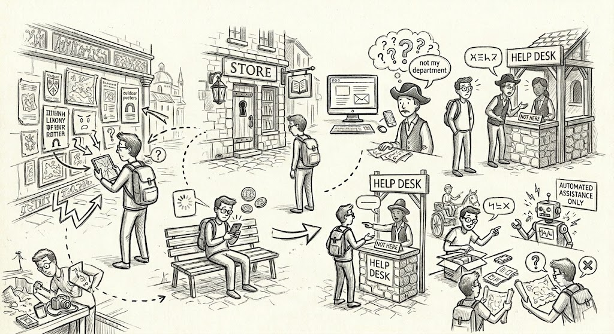
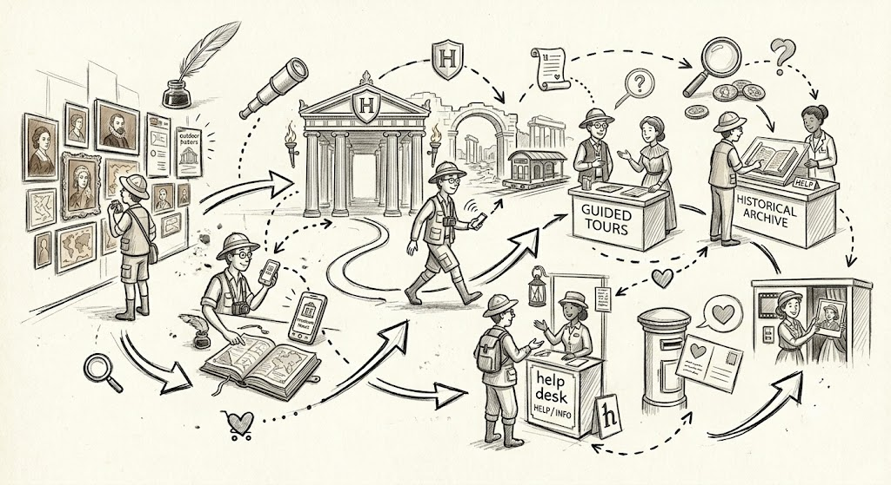

At some point, your small business or organization has said, "how do we reach more people and update them on what we are doing?"

You look at your budget and think, "let's update the website."

Maybe you've hired someone to do exactly that on a quarterly basis. But here's the thing... the website gets refreshed and the problem doesn't go away. Because the real issue isn't outdated content. It's that your website doesn't talk to anything else. It just sits there as silo. 

So how does this translate for your users? It adds friction and makes it harder for them to find the content they are looking for. And they give up or go elsewhere before you've had a chance to reach them. 

## Touchpoints are the key

Think about this from another perspective... you get contacts from your website, and maybe from other mailing lists, as well. You want specific data to flow automatically from one place to another. Of particular interest are the places where your organization connects with its users and stakeholders. These are touchpoints.

Your website is a touchpoint, a mailing list is a touchpoint, email is a touchpoint, even Discord is a touchpoint.

When you don't connect your workflow and data across touchpoints, you increase friction.

## Why websites are data tools

We tend to think of a website as a static brochure... that has an update cycle. However, these days dynamic websites are very accessible and easier to build and maintain than ever. 

When I say your website should function as a data tool, I mean a few specific things:

- **Forms that write directly to other systems.** Instead of sending you an email you have to re-type, a web form can write to a spreadsheet, a simple database, or a lightweight customer relations management (CRM) board. No copy-paste and no missed submissions.
- **Content driven by your records.** An events calendar that pulls from a shared spreadsheet. A program directory that reflects your current offerings, not a static page you update by hand.
- **Search that answers questions.** Instead of a wall of text, a search interface lets people find what they actually need... for example, "what events are coming up?" or "how do I apply?"
- **Visibility into what's being asked.** When your site, touchpoints, and data connect, you can see which questions are popular and use that to improve your communications.

The net result is that both your organization and your customers will connect with greater ease and less friction. Information is easier to find, and your customer's journey is ultimately more successful.

## Why this matters for small organizations specifically

Larger organizations have staff dedicated to keeping data consistent across systems. Small ones don't. Every manual re-entry step is a place where information drifts, names get spelled differently, or records go missing.

Connecting your website to your actual data... even at a basic level... shrinks that surface area. You maintain one version of the truth, and your site reflects it.

## Where to start

The easiest first step is usually a form-to-spreadsheet connection. Most organizations already have a contact form and a Google Sheet or Airtable where they track inquiries. Wiring those two together is a small project with immediate payoff.

From there, it's a short step to a simple public-facing directory, a calendar, or a basic Q&A interface. Each of these follows the same pattern: your data in one place, the website as a view into it.

In my experience, teams pick this up faster than they expect... you don't need a developer on retainer to keep these kinds of connections running.

If you're curious whether this kind of setup would work for your organization, [let's talk](/contact). I can usually sketch a simple solution in a single conversation.
