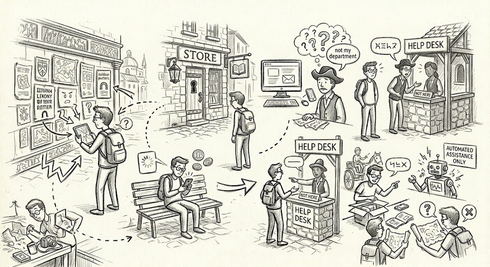
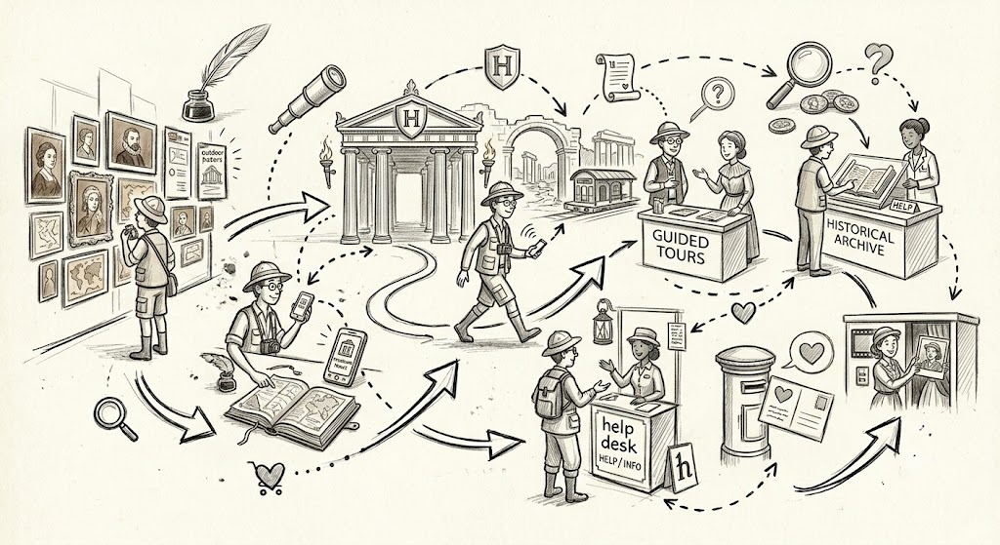

Recently, I was talking with a friend about a group that she works with. She told me that the executive board for this group felt that they were out of touch with their members and wanted to update the website to make it more current. In conversation, I learned that an important feature of their site is a roster of member companies and contact information for individual representatives. 

So, I asked her a few questions such as, "is your mailing list current"? (no.) "How do you inform members of meetings and updates?" (newsletter to the wonky mailing list). "How do you gather feedback from members?" (emails that go into a secretarial box.) "How do you know the list of companies and members is still accurate?" (it's not.)

During the course of this conversation, she realized that the core issue was not the website, but process and workflow (including automation). She asked, "how do we get that AND the website updates, also?"

## "Touchpoints" are the key

Let's frame this challenge a bit differently. Let's say your website does a good job collecting contacts from website forms. Maybe you also get leads from mailing lists, as well. But these leads and contacts drop into someone's email box and that person has to manually update a list and data in other documents. Maybe you had a lapse where there was no secretary -- or he was very busy and accidentally introduced typos or missed updating some particular database. 

Ideally, we want specific data to flow automatically from one place to another. Of particular interest are the *places where your organization connects with its users and stakeholders*. These are **touchpoints**.

From this vantage, your website is a touchpoint, a mailing list is a touchpoint, email is a touchpoint, even Discord is a touchpoint. Even a face-to-face interaction is a touchpoint! **Data flows through these touchpoints.**

By now you might be thinking... hmmm, I feel like I've experienced the challenge of not getting responses from so-and-so over the phone, email, list, etc. Why is this so hard!?

## Why websites are data tools - and touchpoints are the connectors between data tools

We tend to think of a website as a static brochure that has an update cycle. However, these days dynamic websites are very accessible and easier to build and maintain than ever. With this in mind, there is no reason the important roster of companies and individuals can't be kept accurate and up-to-date on the website mentioned earlier. 

The goal is to eliminate the busy human reading email, updating databases, and passing new content to the website administrator and add some automation between touchpoints. 

In the end, I suspect that the executives wanted this particular problem solved, but focused on the website because it was cognitively easier to process, and a problem that could be delegated to a third party. Unfortunately, the website administrator is unlikely to solve the actual problem, if it's conveyed as "website updates."

Let's not stop at this. We can eliminate other friction from business process and user satisfaction:

- **Forms that write directly to other systems.** Instead of sending you an email you have to re-type, a web form can write to a spreadsheet, a simple database, or a lightweight customer relations management (CRM) board. No copy-paste and no missed submissions.
- **Content driven by your records.** An events calendar that pulls from a shared spreadsheet. A program directory that reflects your current offerings, not a static page you update by hand.
- **Search that answers questions.** Instead of a wall of text, a search interface lets people find what they actually need... for example, "what events are coming up?" or "how do I apply?"
- **Visibility into what's being asked.** When your site and data connect, you can see which questions are popular and use that to improve your communications.

Did we reach nirvana? Probably not. But I expect that organization and customers will connect with greater ease and less friction and the customer's journey is ultimately more satisfactory.

## Why this matters for small organizations specifically

Larger organizations have staff dedicated to keeping data consistent across systems. Small ones don't. Every manual re-entry step is a place where information drifts, names get spelled differently, or records go missing.

Connecting your website to your actual data... even at a basic level... shrinks that surface area and binds data across touchpoints. You maintain one version of the truth, and your site reflects it.

## Where to start

The easiest first step is usually a form-to-spreadsheet connection. Most organizations already have a contact form and a Google Sheet or Airtable where they track inquiries. Wiring those two together is a small project with immediate payoff.

For a non-profit, CRM tools such as monday.com may be available for free - and offer automations that solve problems beyond bridging touchpoints.

From one small automation, it's a short step to another such as a simple public-facing directory, a calendar, or a basic Q&A interface. Each of these follows the same pattern: your data in one place and the website with a view into it.

In my experience, teams pick this up faster than they expect... you don't need a developer on retainer to keep these kinds of connections running.

If you're curious whether this kind of setup would work for your organization, [let's talk](/contact). I can usually sketch a simple solution in a single conversation. If you don't have time to build this yourself, I can help.
